# Robinhood 

### Application is live at 

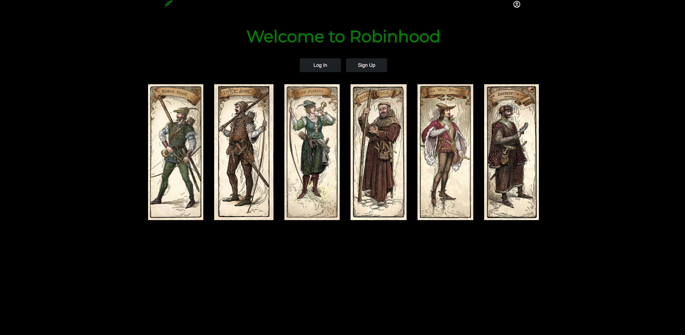  

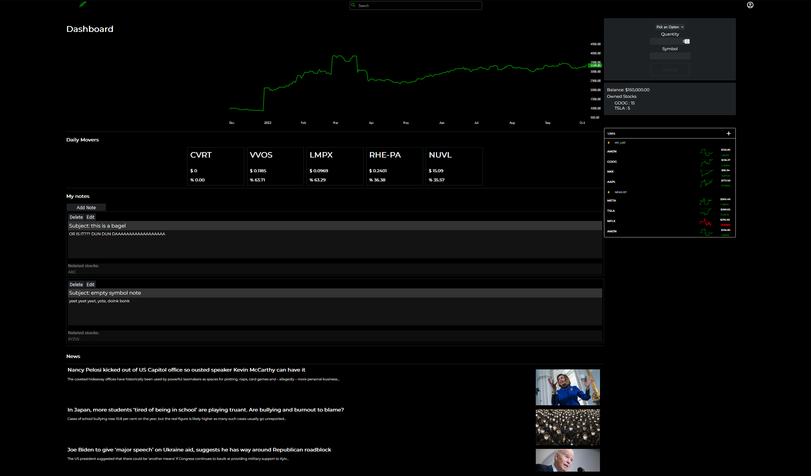

Robinhood is a clone of Robinhood.com. It mimcs the functionality of buying and selling stock using real time stock data. With designed inspired by Robinhood.com, this platform proviedes users access to stock information, create watchlists amd keep notes realted to their investments. 

## Table of Contents

- [Installation](#installation)
- [Usage](#usage)

## Installation 

To get started with JobSphere, follow these steps:

1. **Clone or fork the project.**
2. **Run 'pipenv install' in the root directory to install server dependecies.** 
3. **Run 'npm install' to install frontend dependencies.**
4. **Run 'pipenv run flask db migrate' and 'pipenv run flask seed all' to add the mock data.**
5. **Run 'pipenv run flask run in the root depsoitory'.**
6. **Run 'npm start' in the react-app folder.**

## Usage

### Stock Details

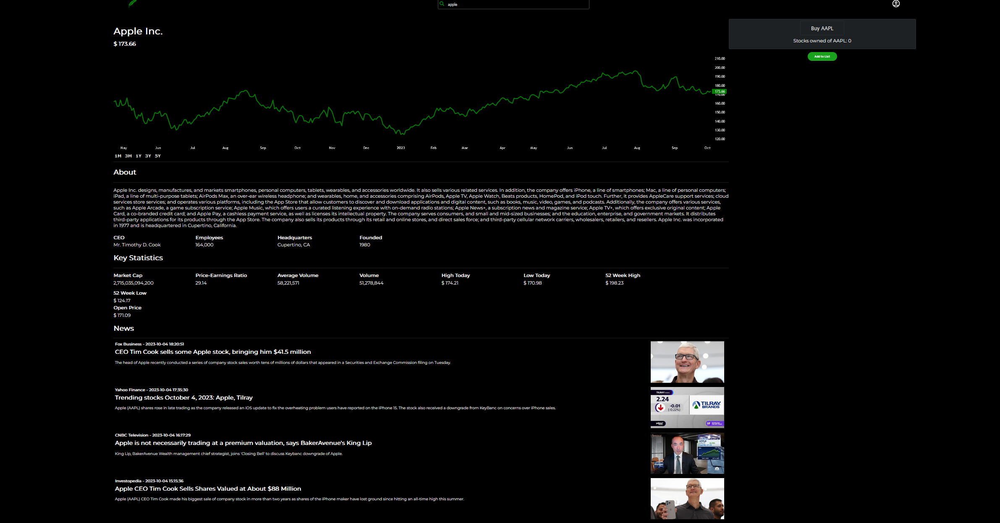

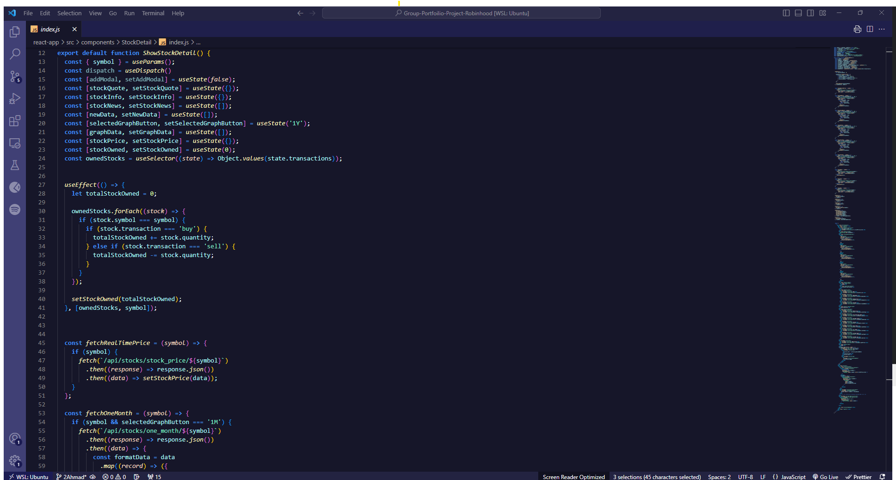

1. **Logged in user can search any stock using the search bar**
2. **Logged in user can view real time stock details including stock Value, About, Key Statistics and News**

### Purchase Stock 

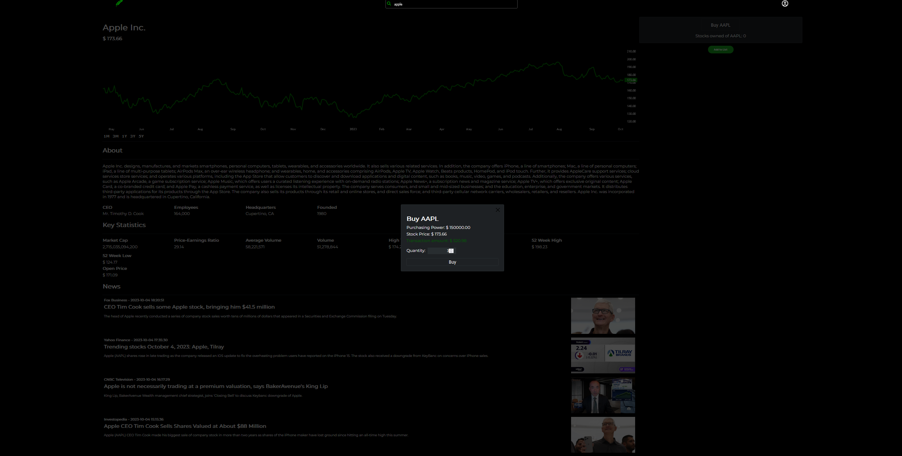

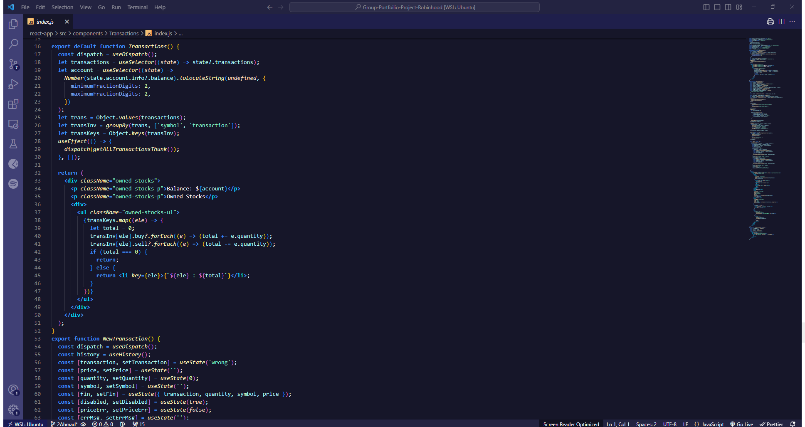

1. **Logged in users can purchase and sell stocks using real-time stock values.**
2. **Logged in users can sell stocks using real-time stock values.**

### Watchlists 

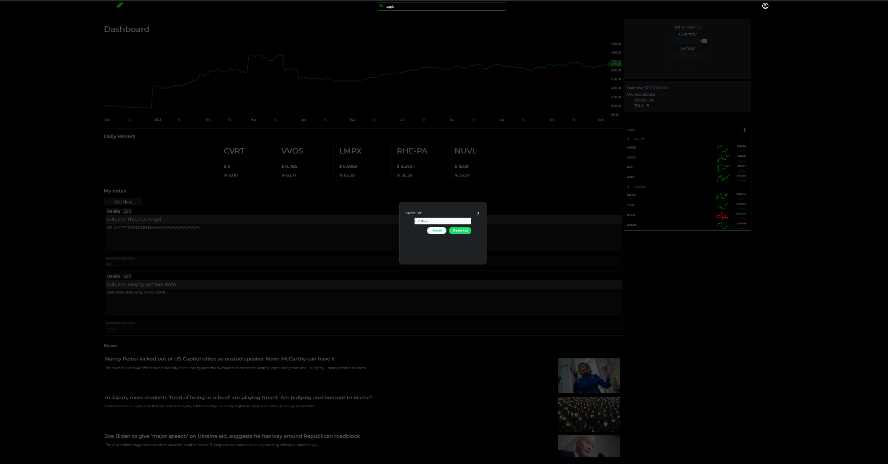

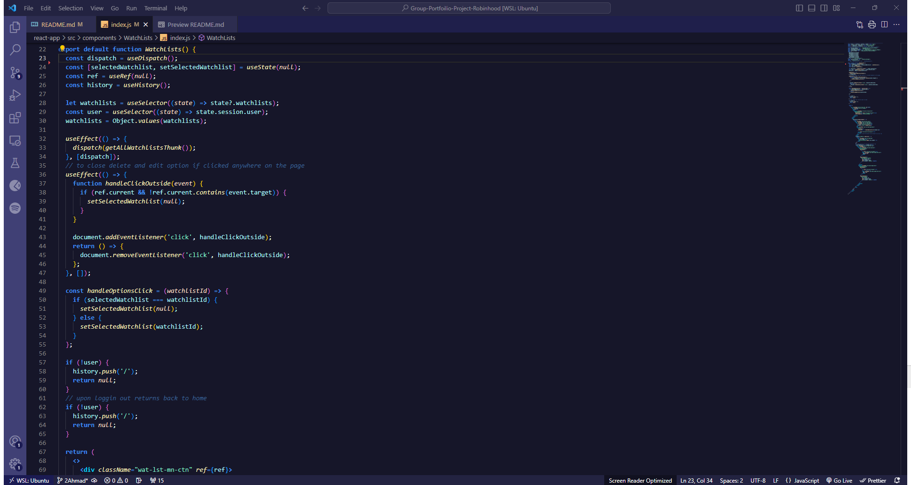

1. **Logged in uses can create watchlist**
2. **Logged in user can view watchlist**
3. **Logged in user can edit watchlist**
4. **Logged in user can delete watchlist**

### Watchlist Stocks

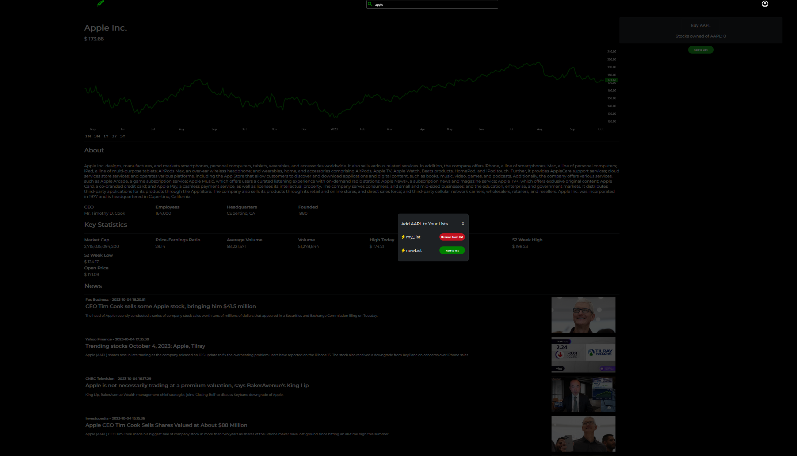

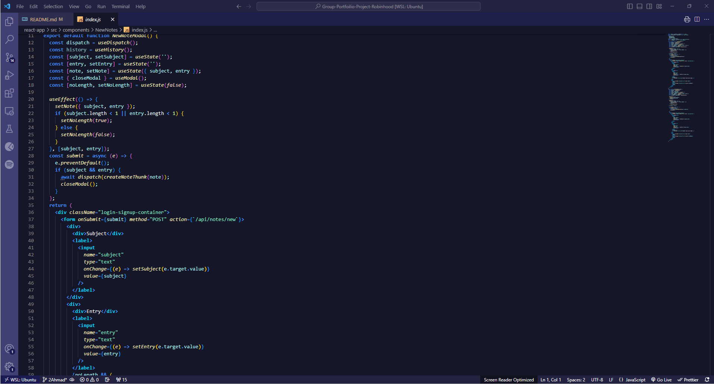

1. **Logged in user can add stocks to watchlist.**
2. **Logged in user can remove stocks from watchlist.**

### Notes 

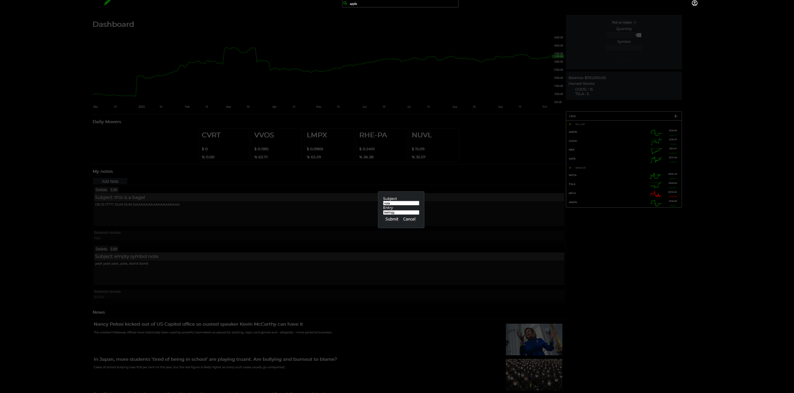

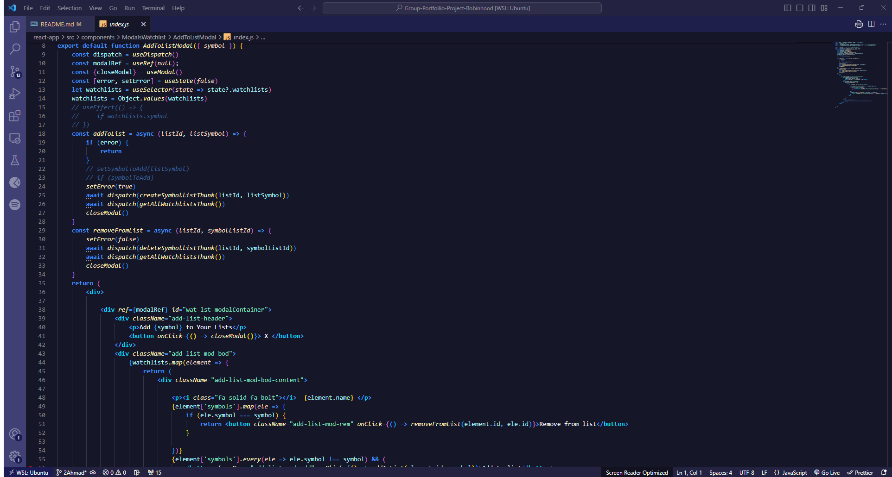

1. **Logged in user can add new Notes.**
2. **Logged in user can view Notes.**
3. **Logged in user can edit Notes.**
4. **Logged in user can delete Notes.**

